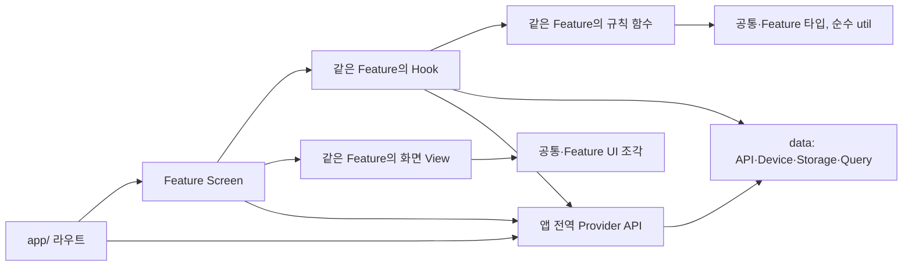

# React Native 개발 구조 및 작업 규칙

이 문서는 새 기능을 개발하는 Agent를 위한 코드 배치, 책임 분리, 상태 관리 기준이다. 구체적인 기능 요구사항은 해당 기능의 specification을 따른다. 아래 meal-checkin 흐름과 파일명은 구조를 설명하는 예시이며, 확정된 화면 명세가 아니다.

## 1. 기본 원칙

- 코드는 `data`, `types`, `providers`, `features`, `components`, `util`을 중심으로 구성한다.
- 기능별 화면과 작업 흐름은 `features`에 모은다.
- UI 표현과 프론트엔드 비즈니스 로직을 분리한다.
- 서버 상태와 요청 상태는 TanStack Query로 관리한다.
- 화면 내부의 일시적인 상태와 작성 중 데이터는 React 상태로 관리한다.
- Navigation·상태 변경·재조회 시 빈 화면이나 잘못된 View가 순간적으로 표시되는 깜빡임을 방지한다.
- 사용자에게 표시하는 문구는 `util/strings.ts`, 색상 정의는 `util/colors.ts` 한 파일에서 각각 관리한다.
- Repository, UseCase, 인터페이스 등의 계층을 미리 만들지 않는다. 실제 반복이나 복잡성이 생기면 추출한다.
- 기존 코드와 패턴을 먼저 확인하고 필요한 파일만 추가한다.

## 2. 디렉토리 구조

```text
src/
  data/
    network/
      httpClient.ts
    device/
      mealPhotoPicker.ts
    api/
      mealApi.ts
      recognitionApi.ts
    storage/
      storageClient.ts
      mealCheckinDraftStorage.ts
    queries/
      mealQueries.ts
      recognitionMutations.ts

  types/
    meal.ts
    food.ts
    child.ts

  providers/
    ProfileProvider.tsx
    AuthProvider.tsx            # 인증이 도입되면 추가

  features/
    meal-checkin/
      screens/
        BeforeMealScreen.tsx
        FoodReviewScreen.tsx
        FoodReviewView.tsx
        AfterMealScreen.tsx
        OutcomeReviewScreen.tsx
      components/
        RecognitionResultList.tsx
        OutcomeSelector.tsx
      hooks/
        useFoodReview.ts
      types.ts
      rules.ts

  components/
    Button.tsx
    TextField.tsx
    FoodItemCard.tsx

  util/
    strings.ts
    colors.ts
    date.ts

  app/
    _layout.tsx
    meal-checkin.tsx
```

구조 예시에 있는 파일을 일괄 생성하지 않고 필요한 것만 작성한다. `providers/`도 여러 기능이 실제로 공유할 상태가 생겼을 때 사용한다. 앱 초기화와 Provider 조합은 `app/_layout.tsx`에서, Navigation은 기존 Expo Router 구성에서 관리한다. 여러 라우트가 한 기능의 초안을 공유해야 하면 루트 레이아웃에서 그 Feature의 Provider를 마운트할 수 있지만, 초안의 소유권과 공개 API는 해당 Feature에 남긴다.

## 3. 각 영역의 책임

### data — 데이터 접근과 서버 상태 관리

- `network`: 여러 HTTP API가 공유하는 전송 설정과 요청·응답 처리. 실제로 필요할 때만 만든다.
- `device`: 카메라·파일 선택 등 기기 API를 감싼 함수. 서버 요청을 담당하는 `api`와 구분한다.
- `api`: 서버 요청 함수, 요청·응답 처리와 변환.
- `storage`: 기능별 로컬 저장 키, 직렬화, 읽기·쓰기.
- `queries`: query key, 조회·mutation Hook, 캐시 갱신 규칙.

API와 Storage 함수는 일반 비동기 함수로 작성한다. HTTP API는 필요하면 `data/network`의 클라이언트를 사용하고, TanStack Query Hook은 API 함수를 사용한다. Feature Hook과 Provider는 의미 있는 Query Hook·API 함수·Storage 함수를 통해 데이터에 접근하며 HTTP 클라이언트를 직접 호출하지 않는다. 데이터 접근 코드에 Navigation, 모달 표시, 입력 상태 등의 UI 동작을 넣지 않는다.

서버 DTO는 API 파일 또는 인접 파일에 둔다. 서버 응답 구조와 앱의 공통 모델이 다르면 이 영역에서 변환한다. TypeScript 타입 선언만으로 외부 응답이 검증되지는 않으므로 필요한 경계에서 실제 검증을 수행한다.

### types — 공통 데이터 타입

여러 기능에서 사용하는 `Meal`, `FoodItem`, `Child` 등의 공통 모델을 정의한다. 기능 전용 입력 상태와 화면 전용 타입은 해당 Feature 내부에 둔다. UI 컴포넌트의 props 타입은 해당 컴포넌트에 인접하게 둔다.

### providers — 앱 전역 상태

여러 기능이 같은 기준으로 읽어야 하는 상태와 명령만 둔다. 현재의 확정된 프로필·앱 언어가 후보이며, 로그인이 추가되면 인증 초기화 상태·세션 식별 정보·로그인/로그아웃 명령도 앱 범위에서 관리한다. 서로 갱신 주기가 다른 책임은 하나의 거대한 Provider에 합치지 않고 `ProfileProvider`, `AuthProvider`처럼 나눈다.

- Provider는 공통 타입과 `data`의 API·Storage·Query에 의존할 수 있지만 특정 Feature의 Screen·Hook·규칙에는 의존하지 않는다.
- Feature는 Provider의 공개된 값과 `commitProfile`, `changeLanguage`, `signOut`처럼 의미가 분명한 명령을 사용한다. 다른 기능에 범용 `setState`를 노출하지 않는다.
- 영속화할 값은 저장 성공 후 전역 상태에 반영한다. 저장 실패 시 기존 확정 상태를 유지하고 호출자에게 실패를 전달한다.
- Feature의 작성 중 초안·단계·입력 오류, 시트 열림 상태, 서버 조회 결과를 앱 전역 Provider에 복제하지 않는다. 인증을 도입하더라도 서버 데이터는 TanStack Query의 소유권을 따른다.

### features — 기능별 화면과 작업 흐름

- `screens`: 화면 단위 파일. Screen은 Feature Hook과 UI 연결 및 Navigation을 처리하고, 분리된 View는 화면 전체의 UI를 그린다.
- `components`: 해당 Feature에서만 쓰는 화면 내부의 작은 UI 조각. 화면 전체의 UI는 아래 화면 기준에 따라 둔다.
- `hooks`: 작성 상태, 사용자 행동, 데이터 작업 흐름 관리.
- `types.ts`: 기능 전용 데이터·작성 상태 타입.
- `rules.ts`: 검증·변환·계산 등의 일반 함수.

복잡한 규칙을 Screen이나 Hook에 몰아넣지 않는다. `rules.ts`는 React, API, Storage에 의존하지 않도록 작성한다. 파일이 커지면 역할별로 분리하되 처음부터 세부 계층을 강제하지 않는다.

### components — 공통 UI

컴포넌트의 위치는 현재 사용 횟수가 아니라 여러 기능·페이지에서 재사용할 가능성으로 결정한다.

- 이 절의 `components`는 화면 전체가 아닌 UI 조각을 뜻한다. 값과 동작은 props로 받고, 업무 데이터나 편집 초안을 내부 상태로 소유하지 않는다. 접힘·펼침 같은 단순한 표시 상태만 내부에 둘 수 있다.
- 여러 기능·페이지에서 사용할 가능성이 있는 컴포넌트는 `src/components/`에 둔다. 현재 한 곳에서만 사용하더라도 이 기준을 적용한다.
- 기능이 더 추가되어도 해당 기능 외에서는 사용할 일이 없을 것으로 판단되는 화면 내부 UI 조각만 `src/features/<feature>/components/`에 둔다.
- 파일 이름이나 최초 구현 위치, 컴포넌트의 크기만으로 공통 여부를 판단하지 않는다. 다른 기능에서도 같은 의미와 동작으로 사용할 수 있는지를 확인한다.
- 공통 컴포넌트는 값과 콜백을 props로 받으며 Feature의 내부 코드·Hook·규칙 함수를 참조하지 않는다. 기능별 동작은 상위에서 콜백으로 전달한다.
- 하나의 파일에 범용 UI와 기능 전용 UI가 섞여 있으면 범용 UI를 추출해 공통으로 이동한다. 공통 컴포넌트를 Feature에서 다시 export하는 중간 파일은 만들지 않는다.

예를 들어 하단 내비게이션, 바텀시트, 선택 행, 카드, 특성 태그, 날짜 선택기, 복수 선택, 음식 편집기는 공통 UI 조각의 후보가 된다. 날짜 선택기·복수 선택·음식 편집기는 입력 초안과 사용자 동작의 결과를 상위에서 관리하고, 선택지와 표시 문구를 props로 받는다. 공통 UI가 온보딩·식사 폼 등 시각적 variant를 제공하는 것은 허용한다.

`HomeView`, `MealCheckinView`처럼 화면 전체를 그리는 View는 해당 Feature의 `screens/`에 둔다. 한 Feature의 화면 수와 화면 간 공유 구조를 살펴 Screen에 UI를 함께 둘지, 화면별 View를 분리할지 결정한다. 온보딩과 식사 기록처럼 단계가 많은 흐름은 상위 View가 단계별 View를 선택하고, 각 단계 View를 `screens/`에 둔다. 날짜·음식 편집 초안처럼 화면 UI보다 오래 유지되는 입력 상태는 Feature Hook이 관리한다. 라우트 연결, Navigation, 데이터 로딩, 기능 Hook을 소유하는 파일은 UI 조각으로 분류하지 않는다.

### util — 공통 기반 도구

날짜·문자열 처리 등 데이터 접근과 무관한 순수 도구를 둔다. HTTP 클라이언트는 `data/network`, 저장소 클라이언트는 `data/storage`에 둔다. 식사 검증이나 인식 결과 병합처럼 업무 의미를 가진 코드는 Feature의 규칙 함수에 둔다.

공통 표시 리소스도 이 디렉토리에서 관리한다. 문구와 색상은 아래 두 파일로 집중하며 Feature별 문자열·색상 파일을 추가하지 않는다.

### 문구·언어 — util/strings.ts

- 버튼, 제목, 안내, 빈 상태, 오류, 접근성 레이블 등 앱이 정의하는 모든 사용자 표시 문구를 이 파일에 둔다.
- `common`, `mealCheckin`, `onboarding` 등 의미별 키로 묶고 UI에서 문자열 리터럴을 직접 작성하지 않는다.
- 사용자 입력·음식명·서버 콘텐츠 자체는 번역 리소스에 넣지 않는다. 서버·네트워크의 원시 오류 메시지를 그대로 노출하지 않고 정의된 오류 코드에 대응하는 문구를 표시한다.
- 규칙 함수는 필요하면 오류 코드를 반환하고, Feature Hook이나 표현 계층에서 표시 문구로 변환한다.
- 동적 문구는 매개변수를 받는 함수로 정의한다. 문장 조각을 UI에서 연결하지 않는다.
- 여러 언어를 지원하면 모든 언어 사전을 이 파일 안에 두고 동일한 키 구조를 유지한다. 앱 언어 선택도 공통 접근 함수로 연결한다.

```ts
// util/strings.ts — 초기 한국어 구성 예시
export const strings = {
  common: {
    save: "저장",
    saving: "저장 중...",
    retry: "다시 시도",
  },
  mealCheckin: {
    saveFailed: "식사 기록을 저장하지 못했습니다.",
    foodCount: (count: number) => `음식 ${count}개`,
  },
} as const;
```

### 색상 — util/colors.ts

- HEX, RGB, RGBA, 투명색 등 앱에서 사용하는 색상 값은 이 파일에서만 정의한다.
- UI, 아이콘, Navigation 테마, 상태 표시줄 설정은 이 파일의 토큰을 참조한다.
- `background`, `surface`, `textPrimary`, `border`, `primary`, `error` 등 역할 기반 이름을 사용한다.
- 다크 모드가 필요하면 같은 파일에서 동일한 키의 light/dark 팔레트를 정의한다. 화면별 팔레트를 만들지 않는다.

```ts
// util/colors.ts — 실제 디자인에 맞게 값 조정
export const colors = {
  background: "#FFFFFF",
  surface: "#F5F5F5",
  textPrimary: "#171717",
  primary: "#2563EB",
  error: "#B91C1C",
  transparent: "transparent",
} as const;
```

## 4. UI와 비즈니스 로직 분리

Container / Presentational 패턴의 책임 구분을 `Screen + Custom Hook + View + UI 조각` 조합으로 적용한다. 별도 Container 파일은 필수가 아니며 Screen이 연결 지점 역할을 한다.

| 구분 | 책임 | meal-checkin 예시 |
| --- | --- | --- |
| Screen | Hook 호출, props 연결, Navigation | FoodReviewScreen.tsx |
| Custom Hook | 편집 상태, 요청 실행, 저장 흐름 | useFoodReview.ts |
| 화면 View | 화면 전체를 props로 표시하고 입력을 콜백으로 전달 | FoodReviewView.tsx |
| UI 조각 | 화면 내부의 재사용 가능한 부분을 표시 | RecognitionResultList.tsx |
| 규칙 함수 | 검증·정규화·결과 병합 | rules.ts |

### 일반적인 의존성 흐름

화살표는 왼쪽 파일이 오른쪽 파일의 공개 API를 참조할 수 있다는 뜻이다. 데이터나 이벤트가 실제로 이동하는 방향과 구분한다. 같은 규칙을 온보딩, 식사 기록, 홈, 향후 인증이 필요한 기능에도 적용한다.



- `app/`의 라우트는 경로 매개변수와 진입 조건을 확인하고 Feature Screen을 연다. 기능별 데이터 조회, 작성 흐름, 검증은 라우트에 두지 않는다.
- Screen은 Feature Hook과 필요한 앱 전역 Provider 값을 연결하고, View에 필요한 값·콜백만 전달하며 Navigation을 처리한다.
- View와 작은 UI 조각은 props를 표시하고 사용자 입력을 콜백으로 알린다. 데이터 접근, 업무 규칙 실행, Navigation, 앱 전역 Provider 직접 읽기는 상위 연결 계층으로 올린다. 단순한 열림·포커스·이미지 표시 오류 같은 표현 상태는 View 안에 둘 수 있다.
- Feature Hook은 작성 초안과 작업 흐름을 소유하고 같은 Feature의 규칙 함수 및 `data` 함수를 호출한다. 여러 화면이 초안을 공유해야 하면 Feature 범위 Provider로 소유권을 명확히 한다.
- 규칙 함수는 React, Navigation, Provider, API, Storage에 의존하지 않는다. 화면 전용 표시값의 조합은 해당 View 근처의 일반 함수에 둘 수 있다.
- 단계가 여러 개인 기능은 상위 View가 단계별 View를 선택할 수 있다. 단계별 View에는 그 단계가 쓰는 props만 전달하고 Feature Hook의 전체 결과 객체나 Context 값을 그대로 넘기지 않는다.

단순한 화면은 Screen과 View를 한 파일에 작성할 수 있다. 책임의 방향은 그대로 지킨다. 현재 일부 기존 라우트가 Feature Hook을 직접 연결하고, 상위 View가 규칙을 실행하거나 단계 View에 넓은 모델을 전달하는 부분은 새 기능과 후속 리팩토링에서 이 기준으로 정리한다.

### UI 표현 계층 규칙

- `screens`의 View와 공통·Feature의 `components`는 모두 UI 표현 영역이다.
- 데이터와 동작은 props로 받는다.
- API, Storage, 업무용 Query Hook, Feature 비즈니스 Hook을 직접 사용하지 않는다.
- 업무 데이터를 읽기 위해 전역 상태나 기능 Context에 직접 접근하지 않는다.
- 화면 이동은 콜백으로 요청하고 Screen에서 연결한다.
- 접힘·펼침, 포커스, 애니메이션 같은 표시 상태는 내부에서 관리할 수 있다.
- 음식 확인 여부, 저장 가능 조건, 편집 초안 같은 업무 상태는 Feature Hook이 관리한다.
- 테마 등의 표현 전용 Context·Hook은 사용할 수 있다.

여기서 UI 분리는 상태가 전혀 없다는 의미가 아니다. 또한 React의 렌더링 순수성 규칙과는 별개의 책임 분리 기준이다.

### Hook과 규칙 함수 규칙

- Feature Hook은 UI에 필요한 값과 작업 함수를 제공한다.
- TanStack Query를 연결하는 공통 데이터 Hook은 `data/queries`에 둔다.
- Feature Hook은 데이터 Hook을 조합하고 기능별 입력 상태와 동작을 연결한다.
- 검증·계산·병합처럼 React 상태가 필요 없는 로직은 일반 함수로 추출한다.
- UI가 TanStack Query의 전체 결과 객체를 알아야 하도록 만들지 않는다. 필요한 데이터·상태·콜백을 명시적으로 전달한다.

### 연결 예시

다음 코드는 책임 연결을 보여주는 발췌이며, import와 타입 세부 구현은 생략했다.

View의 `strings`와 `colors`는 각각 `util/strings.ts`와 `util/colors.ts`에서 가져온다. 예시의 `error` prop은 사용자 표시용으로 변환된 문구다.

```tsx
// screens/FoodReviewScreen.tsx
export function FoodReviewScreen() {
  const review = useFoodReview();

  return (
    <FoodReviewView
      foods={review.foods}
      isSaving={review.isSaving}
      error={review.error}
      onChangeFood={review.changeFood}
      onSave={review.save}
    />
  );
}
```

```tsx
// screens/FoodReviewView.tsx
export function FoodReviewView({
  foods,
  isSaving,
  error,
  onChangeFood,
  onSave,
}: FoodReviewViewProps) {
  return (
    <View style={{ backgroundColor: colors.background }}>
      <RecognitionResultList
        foods={foods}
        onChangeFood={onChangeFood}
      />
      {error && <Text style={{ color: colors.error }}>{error}</Text>}
      <Button
        title={isSaving ? strings.common.saving : strings.common.save}
        disabled={isSaving}
        onPress={onSave}
      />
    </View>
  );
}
```

복잡한 기능 화면은 Screen과 View를 분리한다. 단순한 화면은 별도 View 파일 없이 UI를 Screen에 작성해도 되지만, 업무 로직은 Hook·규칙 함수에 둔다. 작은 UI 요소까지 일괄적으로 Container·View 쌍을 만들지 않는다.

## 5. 의존성 규칙

| 영역 | 참조 가능한 영역 |
| --- | --- |
| `app/` 라우트·레이아웃 | 앱 전역 Provider의 공개 API, Feature의 Screen, 공통 UI·타입·util |
| 앱 전역 Provider | data, 공통 types, util |
| Feature Screen | 같은 Feature의 Hook·View, 앱 전역 Provider의 공개 API, UI 조각, 타입·util |
| Feature View | 같은 Feature의 단계 View·전용 UI 조각, 공통 components, 타입·util |
| Feature 전용 UI 조각 | 같은 Feature의 전용 UI 조각, 공통 components, 타입·util |
| Feature Hook | 같은 Feature의 규칙·타입, data, 앱 전역 Provider의 공개 API, 공통 타입·util |
| Feature 규칙 함수 | 같은 Feature의 타입, 공통 타입, 순수 util |
| data | types, util |
| 공통 components | types, util, 다른 공통 컴포넌트 |
| types | 다른 타입 파일 |
| util | 공통 타입, 다른 유틸리티 |

표의 허용 범위 안에서도 코드의 책임을 따른다. UI가 `data/network/httpClient` 또는 `data/storage/storageClient`를 사용해 데이터 접근 제한을 우회해서는 안 된다. `data/network`는 `data/api`에서만 사용하고 Feature Hook·Provider가 직접 참조하지 않는다. `app/`과 Provider는 Feature의 내부 규칙·Hook에 역으로 의존하지 않는다. 여러 Feature를 조합해야 한다면 상위 Screen에서 각 Feature의 공개 인터페이스를 연결한다.

- 순환 의존성을 만들지 않는다.
- Feature끼리 내부 파일을 직접 참조하지 않는다. 공통 책임은 적절한 최상위 영역으로 이동한다.
- Screen·UI Component에서 HTTP 요청이나 저장소 접근을 직접 수행하지 않는다.
- Feature Hook은 `data/queries`의 Hook과 필요한 Storage 함수를 사용한다.
- `rules.ts`는 필요한 타입과 순수 유틸리티만 참조한다.
- 공통 코드가 Feature에 의존하지 않도록 한다.
- 앱 전역 Provider가 특정 Feature의 초안이나 규칙을 import하지 않도록 한다. Feature는 Provider가 제공하는 명령을 호출할 수 있지만 Provider는 Feature를 호출하지 않는다.
- `eslint.config.js`가 라우트의 직접 데이터 접근, View의 Hook·Provider·규칙 import, 공유 영역의 Feature 내부 import를 제한한다. 새 경계가 필요하면 규칙을 무력화하지 말고 소유권과 의존 방향을 먼저 문서화한다.

## 6. 상태 관리 규칙

| 상태 | 소유자 |
| --- | --- |
| 앱 시작 시 확정해야 하는 프로필·언어, 향후 인증 세션과 초기화 상태 | 앱 전역 Provider |
| 서버 또는 로컬 저장소에서 비동기로 조회한 공유 데이터와 요청 상태 | TanStack Query |
| 기능의 작성 초안·단계·저장 흐름 | 해당 Feature Hook 또는 Feature 범위 Provider |
| 화면의 단순한 표시 상태 | 해당 View 또는 UI 조각 |

전역 Provider의 초기화 상태는 `미확인`과 `확인 완료 후 값 없음`을 구분한다. Feature가 전역 값을 변경할 때는 Provider의 명시적 비동기 명령을 호출한다. Provider가 영속화에 성공한 뒤 확정 상태를 갱신하고, 실패하면 기존 상태를 유지한다. Feature는 성공 후 자신의 초안을 정리하고 Screen이 화면을 이동시킨다. 인증을 추가할 때도 같은 소유권을 적용하며, 서버 응답 전체를 Provider에 중복 저장하지 않는다.

### 서버 상태와 요청 상태 — TanStack Query

현재 프로토타입의 일부 Query는 AsyncStorage 함수를 감싸며, 이 경우 Storage가 영속 데이터의 기준이고 Query는 조회 결과와 갱신 상태를 공유한다. 나중에 서버 API로 바뀌어도 Feature의 View가 데이터 소스를 직접 알지 않게 한다.

- 조회는 `useQuery`, 변경·인식·업로드 등의 작업 요청은 `useMutation`을 사용한다.
- query key 정의는 `data/queries`에 모은다.
- 아이 ID, 기록 ID, 필터 등 조회 결과를 구분하는 조건을 query key에 반영한다.
- 저장·수정·삭제 후 관련 캐시를 갱신하거나 무효화한다.
- 서버 데이터를 별도 전역 상태에 중복 저장하지 않는다.
- Query가 제공하는 로딩·실패 상태를 별도 state로 복제하지 않는다.
- 생성·업로드 mutation의 재시도는 중복 처리 가능성을 확인한 뒤 설정한다.

### 화면 상태와 작성 중 데이터 — React 상태

- 모달 열림, 선택 항목 등은 `useState`로 관리한다.
- 복잡한 작성 상태는 `useReducer`를 사용할 수 있다.
- 여러 단계가 같은 초안을 공유하면 Feature 범위의 Provider가 상태를 소유하고 Feature Hook이 이를 읽는다.
- 같은 Custom Hook을 여러 화면에서 호출하는 것만으로 상태가 공유되지는 않는다.
- 서버 데이터를 편집할 때는 별도의 편집 초안을 두고 저장 성공 시 서버 캐시를 갱신한다.
- 재조회 결과가 사용자 편집 내용을 무조건 덮어쓰지 않도록 한다.

별도 전역 상태 라이브러리는 현재 도입하지 않는다. TanStack Query 캐시를 모달·입력 초안 등의 범용 상태 저장소로 사용하지 않는다.

### 로컬 영속화 — Storage

상태 관리와 로컬 영속화는 별개다. 재시작 후 복구해야 하는 초안은 Storage 함수로 저장·복원한다. 서버 데이터, 로컬 초안, 캐시 중 어떤 값이 기준인지 기능별로 정한다. 로컬 저장을 사용한다는 이유로 오프라인 동기화까지 자동으로 지원한다고 가정하지 않는다.

## 7. 화면 전환과 상태 변경의 시각적 안정성

Navigation과 상태 변경 시 의도하지 않은 빈 화면, 다른 단계의 View, 기본 테마가 잠깐 보이는 현상을 발생시키지 않도록 구현한다. 필요한 로딩·오류 화면과 의도된 전환 애니메이션은 허용하되, 잘못된 상태를 먼저 그렸다가 교체하지 않는다.

### 초기화와 Navigation

- 인증, 앱 언어·테마, 복구할 초안 등 초기 화면을 결정하는 값은 `미확인`과 `확인 완료`를 구분한다. 미확인 값을 로그아웃·초안 없음으로 취급하여 다른 화면을 먼저 표시하지 않는다.
- 초기화 동안 일관된 시작 화면 또는 로딩 영역을 표시하고, 필요한 값이 준비되면 올바른 화면으로 전환한다.
- 초안 복구 시 빈 입력 폼을 먼저 표시하고 뒤늦게 채우지 않는다. 복구 여부가 확정될 때까지 안정적인 준비 상태를 표시한다.
- Navigator와 Provider를 일반적인 입력·로딩 변화에 따라 재생성하거나 교체하지 않는다. 인증 전환 등 실제 흐름 변경은 명시적으로 처리한다.
- Navigation은 명확한 이벤트 또는 한 번 처리되는 상태 전환에 연결한다. 반복 Effect·중복 탭으로 같은 화면을 여러 번 열지 않는다.
- 앱 루트, Navigator, 각 Screen, 시작 화면의 배경은 `colors.ts`의 일관된 토큰을 사용하여 전환 중 기본 흰색 등의 배경이 노출되지 않게 한다.

### 조회·저장·화면 상태

- 최초 데이터 준비와 기존 데이터의 백그라운드 재조회를 구분한다. `isFetching`만을 이유로 화면 전체를 로딩 View로 교체하지 않는다.
- 유효한 기존 데이터가 있으면 같은 콘텐츠를 유지하고 필요한 위치에 갱신 표시를 둔다. 데이터가 없는 최초 조회에만 준비 UI를 표시한다.
- 조회 완료 전 `data ?? []`를 근거로 '기록 없음' View를 표시하지 않는다. 미조회·로딩·오류·확정된 빈 결과를 구분한다.
- 아이나 기록 ID가 바뀌면 이전 대상의 데이터를 새 대상의 결과처럼 표시하지 않는다. 이전 결과 유지가 적절한 조회에서만 placeholder 동작을 사용한다.
- 저장 중에는 입력 화면을 유지하고 버튼 상태나 진행 표시를 변경한다. 저장 실패 시 초안과 화면을 유지한다.
- 사진이나 편집 데이터가 준비되기 전에 다음 단계로 변경하지 않는다. 하나의 전환에 필요한 상태는 함께 갱신하여 '다음 단계 + 아직 없는 데이터' 같은 중간 상태를 막는다.
- 이전 요청이 늦게 도착해 현재 사진·기록의 결과를 덮어쓰지 않도록 요청 대상과 결과의 ID를 확인하거나 취소·무시 정책을 둔다.

### 컴포넌트와 레이아웃

- 항목 ID 등 안정적인 key를 사용한다. 무작위 값·현재 시각을 key로 사용하거나 화면 key를 불필요하게 변경하지 않는다.
- 렌더 함수 내부에서 새 컴포넌트 타입을 정의하지 않는다. 의도하지 않은 remount와 입력·스크롤 상태 초기화를 방지한다.
- 데이터로 계산할 수 있는 표시 값은 렌더 시 계산한다. 불필요한 Effect로 뒤늦게 보정하여 잘못된 View가 한 프레임 보이게 만들지 않는다.
- 이미지 영역과 로딩 placeholder에 크기를 확보한다. 버튼 문구·오류 표시·이미지 로딩으로 주변 레이아웃이 불필요하게 튀지 않게 한다.
- 깜빡임을 숨기기 위한 임의의 timeout이나 모든 전환 애니메이션 비활성화를 기본 해결책으로 사용하지 않는다. 상태·초기화·remount 원인을 해결한다.

### 검증 기준

- 화면 진입·뒤로가기·빠른 연속 탭·단계 이동에서 잘못된 화면이나 빈 프레임이 보이지 않는다.
- 느린 네트워크·재조회·저장 실패에서도 기존 콘텐츠와 초안이 불필요하게 사라지지 않는다.
- 앱 재시작·초안 복구·백그라운드 복귀에서 잘못된 초기 화면이 노출되지 않는다.
- 사진·기록·아이 변경 시 이전 대상의 응답이 현재 화면을 덮어쓰지 않는다.
- 변경한 흐름은 실제 RN 실행 환경에서 확인한다. 육안으로 판단하기 어려운 순간적 전환은 화면 녹화 등으로 확인한다.

## 8. meal-checkin 작업 흐름 예시

1. Screen에서 사진 선택 이벤트를 받는다.
2. Feature Hook이 인식 mutation을 실행한다.
3. `data/api`의 함수가 인식을 요청한다.
4. Feature Hook이 규칙 함수로 결과를 편집 초안에 반영한다.
5. View가 초안을 표시하고 수정 이벤트를 콜백으로 전달한다.
6. Feature Hook이 초안을 검증하고 저장 mutation을 실행한다.
7. 저장 성공 후 데이터 Hook이 관련 식사 캐시를 갱신한다.
8. Screen이 성공 결과에 따라 다음 화면으로 이동한다.

이 기능에서는 AI 제안과 사용자 확인 결과를 구분하고, 수정 시 기존 항목 ID를 유지한다. 식전·식후 단계 사이에 작성 흐름이 종료되면 저장된 기록 ID로 데이터를 다시 조회한다. 초안을 계속 메모리에 보관해야 한다고 가정하지 않는다.

## 9. Agent의 새 기능 개발 순서

1. **기존 구현과 specification 확인**
   - 관련 Feature, 공통 타입·컴포넌트, API·Query·Storage를 확인한다.
   - 기존 의존성, 명명, Navigation 패턴을 따른다.
   - `util/strings.ts`와 `util/colors.ts`의 기존 키·토큰을 확인한다.
2. **데이터와 상태 구분**
   - 서버 데이터, 편집 초안, UI 상태, 로컬 영속 데이터를 구분한다.
   - 소유 위치, 기준 데이터, 갱신·복원 시점을 정한다.
   - 초기 준비 상태와 백그라운드 갱신을 구분하고, 단계 전환의 준비 조건을 정한다.
3. **파일 배치**
   - 데이터 접근은 `data`, 공통 타입은 `types`에 둔다.
   - 화면·작업 흐름·기능 전용 UI는 해당 Feature에 둔다.
   - 공통 UI는 `components`, 범용 기반 도구는 `util`에 둔다.
   - 신규 표시 문구와 색상은 각각 `strings.ts`, `colors.ts`에 추가한다.
4. **데이터 작업과 규칙 구현**
   - API·Storage 함수, TanStack Query Hook, 필요한 규칙 함수를 구현한다.
5. **로직과 UI 연결**
   - Feature Hook에서 상태와 작업 흐름을 연결한다.
   - UI는 props와 콜백을 기준으로 구현한다.
   - Screen에서 Hook·UI·Navigation을 연결한다.
6. **동작 검증**
   - 정상 동작, 입력 오류, 요청 실패, 중복 제출을 확인한다.
   - 저장 후 관련 화면의 데이터 갱신을 확인한다.
   - 요구되는 경우 초안 복구, 단계 이동, 이전 요청의 늦은 응답을 확인한다.
   - 변경한 Navigation·상태 전환에서 깜빡임, 잘못된 View, remount, 레이아웃 튐이 없는지 확인한다.
   - 프로젝트의 타입 검사·린트와 변경에 필요한 테스트를 실행한다.

## 10. 완료 전 확인

- UI 파일에 업무 규칙이나 데이터 접근이 섞이지 않았는가?
- React와 무관한 규칙이 일반 함수로 분리되어 있는가?
- 서버 상태와 편집 초안의 소유권이 명확한가?
- query key와 저장 후 캐시 갱신이 올바른가?
- 여러 기능·페이지에서 재사용할 가능성이 있는 UI 조각은 `src/components/`에, 기능 전용의 화면 내부 UI 조각은 `src/features/<feature>/components/`에 있는가? 화면 전체의 UI는 별도로 검토했는가?
- 기존 항목 ID와 사용자 수정 내용이 보존되는가?
- 불필요한 계층·라이브러리·파일을 추가하지 않았는가?
- 표시 문구와 색상이 각각 `util/strings.ts`, `util/colors.ts`에서 관리되는가?
- 최초 준비·빈 결과·재조회 상태가 구분되고 기존 콘텐츠가 안정적으로 유지되는가?
- Navigation·초안 복구·상태 변경에서 잘못된 View가 순간적으로 표시되지 않는가?

## 참고 자료

아래 자료는 패턴의 배경이다. 파일 배치와 import 제한은 이 프로젝트에서 선택한 규칙이며 RN의 필수 구조는 아니다.

- [React: Reusing Logic with Custom Hooks](https://react.dev/learn/reusing-logic-with-custom-hooks)
- [Dan Abramov: Presentational and Container Components](https://medium.com/@dan_abramov/smart-and-dumb-components-7ca2f9a7c7d0)
- [React: Scaling Up with Reducer and Context](https://react.dev/learn/scaling-up-with-reducer-and-context)
- [TanStack Query: React Native](https://tanstack.com/query/latest/docs/framework/react/react-native)
- [React: Preserving and Resetting State](https://react.dev/learn/preserving-and-resetting-state)
- [React: You Might Not Need an Effect](https://react.dev/learn/you-might-not-need-an-effect)
- [TanStack Query: Queries](https://tanstack.com/query/latest/docs/framework/react/guides/queries)
